# Operationalizing-an-AWS-ML-Project
## Dog Image Classification

Project Summary

1. Train and deploy a model on Sagemaker, using the most appropriate instances. Set up multi-instance training in Sagemaker notebook.
2. Adjust your Sagemaker notebooks to perform training and deployment on EC2.
3. Set up a Lambda function for the deployed model. Set up auto-scaling for deployed endpoint as well as concurrency for Lambda function.
4. Ensure that the security on Machine Learning pipeline is set up properly.

### Step 1: Training and deployment on Sagemaker

- **Created SageMaker notebook instance** 
Using the instance ml.t3.medium type for sagemaker notebook is sufficient for running the job.

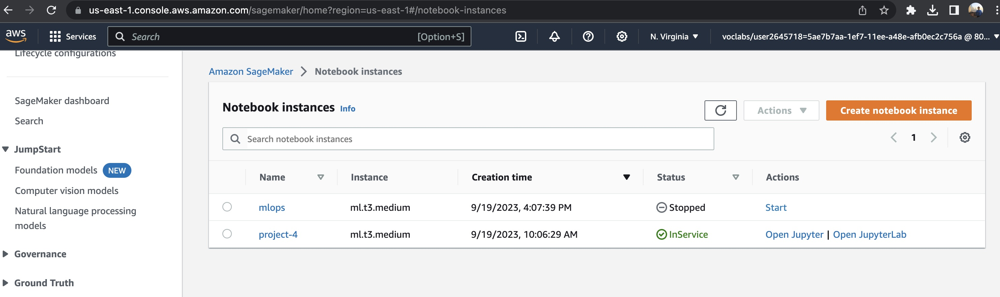

- **S3 bucket** is created and upload all the images for training, validation and test, also model artifacts.

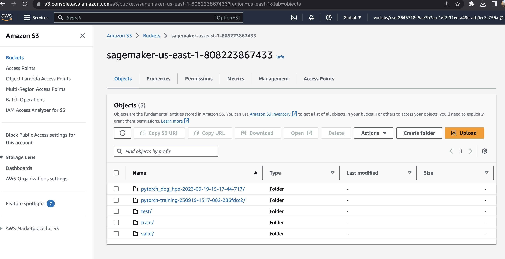

- **Set up policy for Sagemaker Notebook**

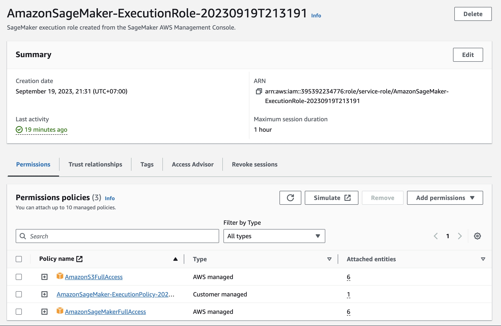

- **Deployment model Endpoints**

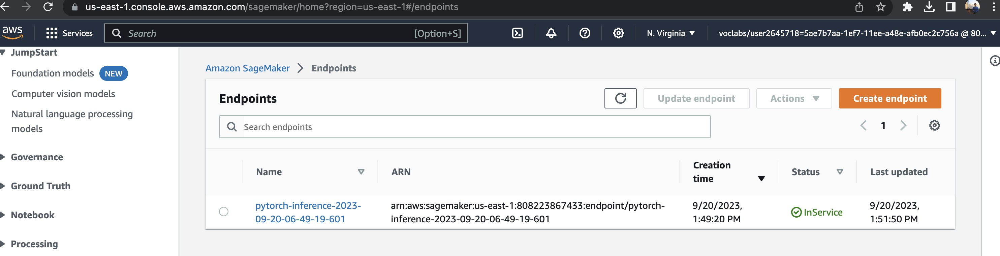

### Step 2: EC2 Training
  Created a EC2 instance with t2.micro type. I decide to choose "Deep Learning AMI GPU PyTorch 1.11.0 (Amazon Linux 2) 20220726" AMI which is the one got all the essential packages inside for deep learning.


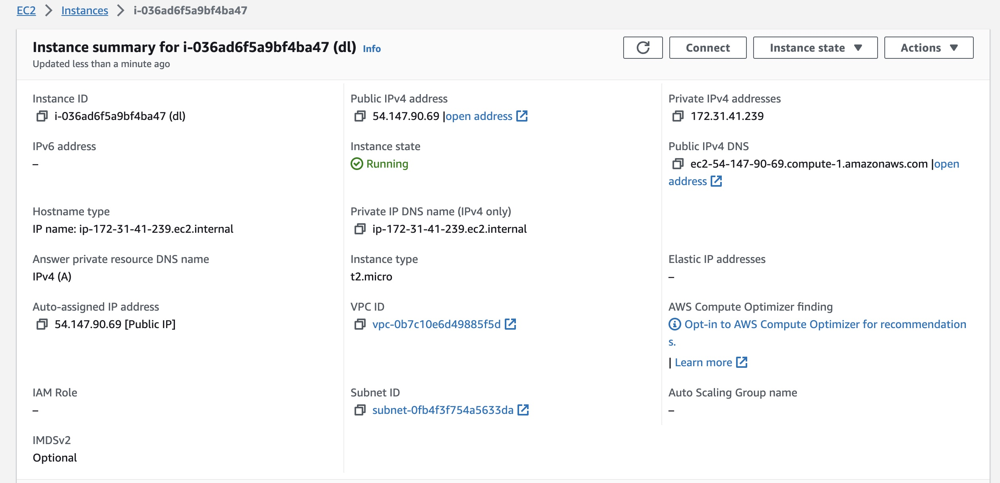

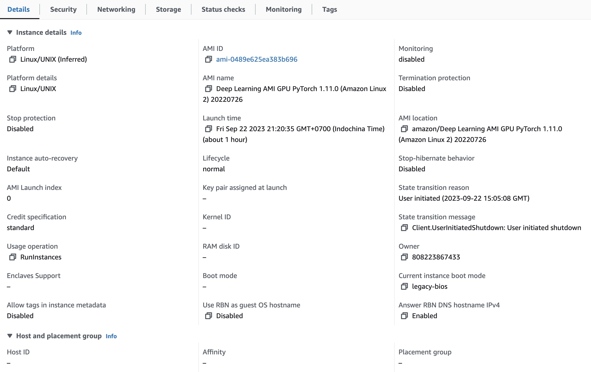

- **Training model inside EC2**

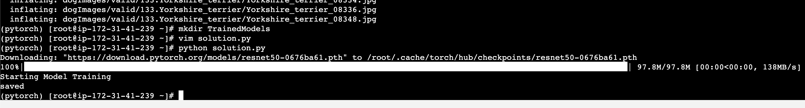

- **Generated a model.pth file in EC2**

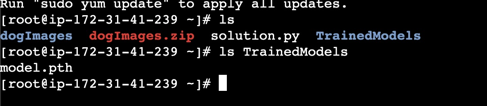

In EC2 training model, we utilize the python script "ec2train1.py". The difference from sagemaker notebook training is that:
- sagemaker note book uses the input of hyperparam from python script "hpo.py" rather than only code inside the "ec2train1.py"
- The code function is mostly likely the same for both version. 


### Step 3: Step 3: Lambda Function Setup 

The model was trained and deployed to the endpoint. In AWS services, we utilize the Lambda function to invoke this endpoint to predict the result from the input. In this scenario, it is a image as an input and result from the model is the prediction. The lambda function make the model become accessible in the production phase of machine learning/deep learning model.


### Step 4: Lambda security setup and testing 

- **Adding SageMaker FullAccess permission to Lambda Functions**

To make anything is safe and secure, IAM role and attached policies will control any services in AWS. For lambda function to access the model endpoint deployed in sagemaker and use the role of lambda function, we are going to set following 2 policies for this lambda function:
1. Basic Lambda Function Execution 
2. Amazon SageMaker Full Access

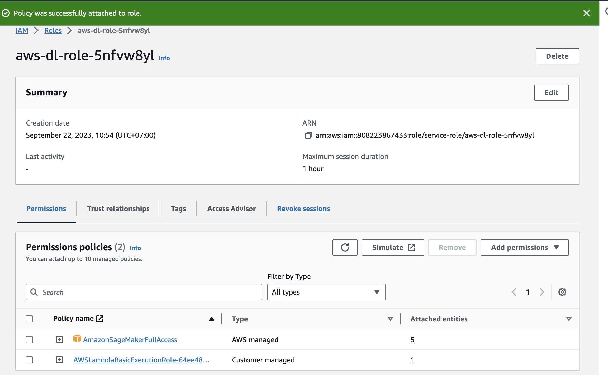

**Vulnerability Assesment** 
For personal project and experiment, we use "Full Access" to erase out any error and lift the barrier as quick as possible. However, for a real project with complex user structures and inactive user/role and some roles have become obsolete that could be a vulnerable to the system and services. Therefore, we should set the role and policies as the most accurate as possible and as minimun as possible to mitigate the risk of any potential vulnerable in the future due to lacking of monitoring the authorized access.

- **Testing Lambda Function**

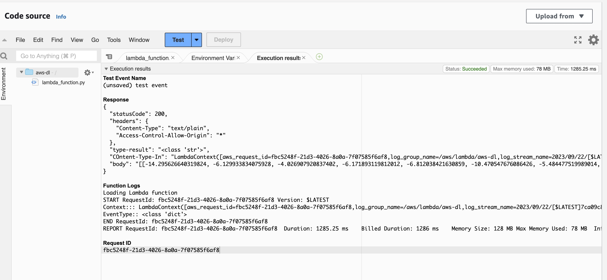

- **Response**
```
Lambda result

Test Event Name
(unsaved) test event

Response
{
  "statusCode": 200,
  "headers": {
    "Content-Type": "text/plain",
    "Access-Control-Allow-Origin": "*"
  },
  "type-result": "<class 'str'>",
  "COntent-Type-In": "LambdaContext([aws_request_id=fbc5248f-21d3-4026-8a0a-7f07585f6af8,log_group_name=/aws/lambda/aws-dl,log_stream_name=2023/09/22/[$LATEST]7ca09c811a1e4f9397fb155daec98b46,function_name=aws-dl,memory_limit_in_mb=128,function_version=$LATEST,invoked_function_arn=arn:aws:lambda:us-east-1:808223867433:function:aws-dl,client_context=None,identity=CognitoIdentity([cognito_identity_id=None,cognito_identity_pool_id=None])])",
  "body": "[[-14.295626640319824, -6.129933834075928, -4.026907920837402, -6.171893119812012, -6.812038421630859, -10.470547676086426, -5.484477519989014, -3.5709800720214844, -13.821308135986328, -3.1856095790863037, -1.4841246604919434, -5.187835216522217, -3.6748807430267334, -0.9065399765968323, -8.134483337402344, -5.918964862823486, -10.31312084197998, -3.087163209915161, -8.066462516784668, 0.16707545518875122, -8.778623580932617, -2.7484562397003174, -12.06652545928955, -13.05517864227295, -7.491897106170654, -12.46111011505127, -5.81804084777832, -7.386822700500488, -9.301037788391113, -3.8537418842315674, -3.4613938331604004, -5.7741241455078125, -10.687592506408691, -4.542523384094238, -14.405861854553223, -8.610401153564453, -6.352445125579834, -9.395635604858398, -1.565516471862793, -7.91764497756958, -7.606410026550293, -6.027561664581299, -0.6298232078552246, -6.674064636230469, -0.42156925797462463, -14.52563190460205, -5.06263542175293, -2.871650457382202, -6.721881866455078, -6.007091999053955, -11.996099472045898, -17.162425994873047, -16.018993377685547, -5.217576026916504, -9.160273551940918, -2.674940824508667, -8.216565132141113, -11.123359680175781, -5.812570095062256, -5.465212821960449, -11.386212348937988, -8.14760971069336, -11.79459285736084, -13.341967582702637, -5.848369598388672, -13.889368057250977, -3.082077980041504, -12.47764778137207, -6.066991329193115, -2.2436559200286865, -1.6839230060577393, -5.699909210205078, -8.593003273010254, -7.2099928855896, -6.954213619232178, -7.968830585479736, -11.843535423278809, -5.419391632080078, -11.499663352966309, -12.13442325592041, -1.1905243396759033, -12.83924674987793, -1.2377082109451294, -4.51748514175415, -11.884766578674316, -8.112951278686523, -3.103135585784912, -13.012654304504395, -5.9189934730529785, -2.1375603675842285, -13.560712814331055, -12.547252655029297, -9.543699264526367, -10.523518562316895, -9.425347328186035, -3.573615789413452, -8.172831535339355, -5.908106327056885, -12.390460014343262, -10.555158615112305, -17.070714950561523, -4.5618438720703125, -5.911552906036377, -6.8571577072143555, -10.668526649475098, -15.31706714630127, -5.108616352081299, -4.255792140960693, -4.225571632385254, -1.776733160018921, -5.506117820739746, -5.547276020050049, -15.493814468383789, -8.60001277923584, -8.396883010864258, -3.574674129486084, -14.671119689941406, -3.986086368560791, -9.409110069274902, -1.884330153465271, -4.696587085723877, -7.475979328155518, -9.566058158874512, -8.4140625, -16.01978874206543, -8.951213836669922, -4.53702974319458, -2.0301969051361084, -12.608107566833496, -10.22558307647705, -8.574698448181152, -3.4569194316864014, -6.506882190704346]]"
}

Function Logs
Loading Lambda function
START RequestId: fbc5248f-21d3-4026-8a0a-7f07585f6af8 Version: $LATEST
Context::: LambdaContext([aws_request_id=fbc5248f-21d3-4026-8a0a-7f07585f6af8,log_group_name=/aws/lambda/aws-dl,log_stream_name=2023/09/22/[$LATEST]7ca09c811a1e4f9397fb155daec98b46,function_name=aws-dl,memory_limit_in_mb=128,function_version=$LATEST,invoked_function_arn=arn:aws:lambda:us-east-1:808223867433:function:aws-dl,client_context=None,identity=CognitoIdentity([cognito_identity_id=None,cognito_identity_pool_id=None])])
EventType:: <class 'dict'>
END RequestId: fbc5248f-21d3-4026-8a0a-7f07585f6af8
REPORT RequestId: fbc5248f-21d3-4026-8a0a-7f07585f6af8	Duration: 1285.25 ms	Billed Duration: 1286 ms	Memory Size: 128 MB	Max Memory Used: 78 MB	Init Duration: 376.92 ms

Request ID
fbc5248f-21d3-4026-8a0a-7f07585f6af8
```
### Step 5: Lambda Concurrency setup and Endpoint Auto-scaling

- **Concurrency**

Concurrency will make your Lambda function better able to accommodate high traffic because it will enable your function to respond to multiple invocations at once.

There are two types of concurrency to consider:

> Reserved concurrency

You can choose to reserve a certain level of concurrency. For example, you can choose to allow your lambda function to be able to access 3 instances to reply to multiple requests simultaneously. You can consider the advantages and disadvantages of reserved concurrency. The advantage is that reserved concurrency has a relatively low cost.
The downside is that the maximum is a hard maximum. If your function receives more than its maximum reserved requests at the same time, you could still have latency issues.

> Provisioned concurrency

The other type of concurrency is called provisioned concurrency. Provisioned concurrency creates instances that are always on and can reply to all traffic without requiring a wait for start-up times.
Provisioned concurrency has a higher cost than reserved concurrency.
But since it turns on instances that are always ready to respond to traffic, it can achieve low latency even in very high traffic scenarios.

For my configuration, I decide to choose provisioned concurrency. I would like to make sure my lambda function get as lower as possbile to latency. I reserved 2 instances for it. 

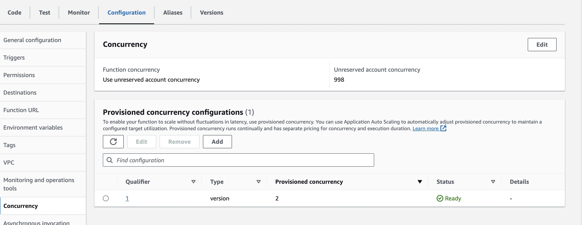


- **Auto-scaling**

Autoscaling allows the deployed model endpoints to respond to multiple requests at the same time.

```
Minimum instances: 1
Maximum instances: 3
```

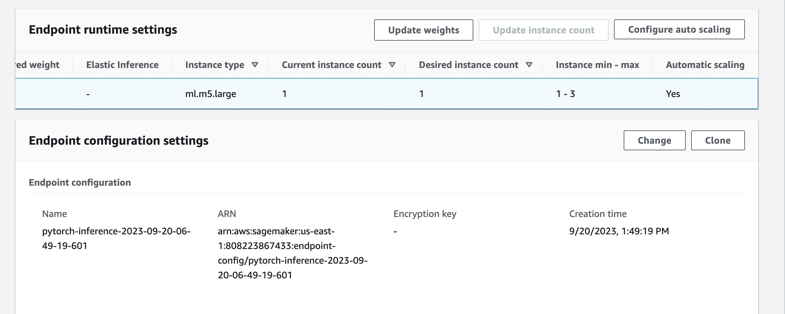